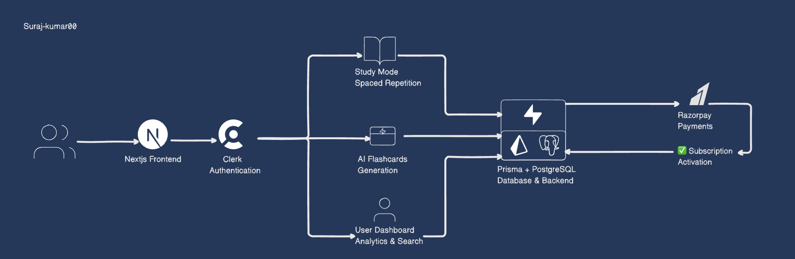

<div align="center">
  
</br>
     </img>
     </img>
    </img>
     </img>
    </img>
    </img
                                                                                                       
[](https://github.com/Suraj-kumar00/Flash-Fathom-AI/actions/workflows/build-push-docker.yml)
</div>

## About Flash Fathom AI

**Flash Fathom AI** is an intelligent flashcard learning platform that revolutionizes how you study and retain information. Powered by advanced AI technology, it combines personalized content generation, spaced repetition algorithms, and intuitive study modes to maximize your learning efficiency.

### Why Choose Flash Fathom AI?

- **AI-Powered Content Generation**: Instantly create flashcards using Gemini API
- **Advanced Spaced Repetition**: Scientific learning algorithms that adapt to you
- **Mobile-First Design**: Study anywhere with responsive UI and gestures
- **Real-Time Search**: Instantly find cards and decks
- **Flexible Subscriptions**: Plans for every learner's needs

[Get Started](https://flash-fathom-ai.vercel.app/) • [🤝 Contribute](#quick-start)

## Demo

<div align="center">
  </img>
</div>

## 🛠️ Tech Stack

### Frontend
- **Next.js 15**
- **TypeScript**
- **Tailwind CSS**
- **shadcn/ui**

### Backend & Database
- **Next.js API Routes**
- **PostgreSQL** (via **Supabase**)
- **Prisma ORM**

### Authentication & Payments
- **Clerk v6**
- **Razorpay**

### AI & APIs
- **OpenAI API**
- **Gemini API**

### DevOps & Deployment
- **Docker**
- **Vercel**
- **GitHub Actions**

## Project WorkFlow




## ✨ Features

###  Core Features

- Secure authentication (Clerk)
- AI-based flashcard generation using Gemini API
- Study modes with spaced repetition
- Real-time global search

### Study Experience

- Touch gesture support
- Difficulty tracking
- Analytics and progress tracking
- Fully responsive & mobile-friendly
- Offline study mode

### Subscription Management

- Free, Basic (₹59/₹590), Pro (₹99/₹990), Org (₹159/₹1,590)
- Monthly/Yearly with 2-month discount
- Razorpay-secured payments
- Learning stats & usage analytics

### Advanced Features

- Real-time search with filters
- Export to PDF or Anki
- Team/Org collaboration
- In-depth performance analytics


##  Quick Start

### Prerequisites

- Node.js 18+
- `pnpm`
- PostgreSQL (or Supabase)
- Clerk account
- Razorpay account
- OpenAI API key

### 1. Clone & Setup

```bash
git clone https://github.com/your-username/Flash-Fathom-AI
cd Flash-Fathom-AI
npm install -g pnpm
pnpm install
```

### 2. Add Environment Variables

Create `.env.local` with the .env.example file we have

### 3. Setup Database

```bash
pnpm prisma generate
pnpm prisma db push
```

### 4. Start Development

```bash
pnpm run dev
# Visit: http://localhost:3000
```

---

## 🐳 Docker Deployment

### Quick Run

```bash
docker pull surajkumar00/flashfathom-ai
docker run -it -p 3000:3000 surajkumar00/flashfathom-ai
```

### Custom Build

```bash
docker build -t flashfathom-ai .
docker run -it -p 3000:3000 --env-file .env.local flashfathom-ai
```
---

## API Documentation

### Auth

- `GET /api/auth/user` – Get current user
- `POST /api/auth/webhook` – Handle Clerk webhook

### Payments

- `POST /api/razorpay/create-order`
- `POST /api/razorpay/verify-payment`

### Study

- `POST /api/study/start`
- `POST /api/study/record`
- `POST /api/study/complete`

### Content

- `GET/POST /api/decks`
- `GET/POST/PUT/DELETE /api/flashcards`
- `GET /api/search`

---

## Issue Reporting

Please include:
- 🔍 **Issue Title**
- 📝 **Description**
- 🚶 **Steps to Reproduce**
- ✅ **Expected vs ❌ Actual Behavior**
- 🖥️ **Environment Info**

[Open an issue](https://github.com/Suraj-kumar00/Flash-Fathom-AI/issues)

---

## 🤝 Contributing

We welcome PRs! [**Read the Contribution Guidlines**](https://github.com/Suraj-kumar00/Flash-Fathom-AI/blob/main/CONTRIBUTING.md)

### Steps:

```bash
# Fork & clone
git checkout -b feature/your-feature
# Make changes
git commit -m "feat: add your feature"
git push origin feature/your-feature
# Open a Pull Request
```

### Standards

- TypeScript
- ESLint + Prettier 
- Before raising PR locally build should pass all checks
- Conventional commits
- Add test coverage

## Contributors

<table>
<tr>
    <td align="center" style="word-wrap: break-word; width: 150.0; height: 150.0">
        <a href=https://github.com/Suraj-kumar00>
            
            <br />
            <sub style="font-size:14px"><b>Suraj</b></sub>
        </a>
    </td>
    <td align="center" style="word-wrap: break-word; width: 150.0; height: 150.0">
        <a href=https://github.com/Shivansh-22866>
            
            <br />
            <sub style="font-size:14px"><b>Shivansh</b></sub>
        </a>
    </td>
    <td align="center" style="word-wrap: break-word; width: 150.0; height: 150.0">
        <a href=https://github.com/milansamuel609>
            
            <br />
            <sub style="font-size:14px"><b>Milan P Samuel</b></sub>
        </a>
    </td>
    <td align="center" style="word-wrap: break-word; width: 150.0; height: 150.0">
        <a href=https://github.com/zaheer-Khan3260>
            
            <br />
            <sub style="font-size:14px"><b>Zaheer khan</b></sub>
        </a>
    </td>
    <td align="center" style="word-wrap: break-word; width: 150.0; height: 150.0">
        <a href=https://github.com/AnushkaChouhan25>
            
            <br />
            <sub style="font-size:14px"><b>Anushka Chouhan</b></sub>
        </a>
    </td>
    <td align="center" style="word-wrap: break-word; width: 150.0; height: 150.0">
        <a href=https://github.com/haseebzaki-07>
            
            <br />
            <sub style="font-size:14px"><b>Haseeb Zaki</b></sub>
        </a>
    </td>
</tr>
<tr>
    <td align="center" style="word-wrap: break-word; width: 150.0; height: 150.0">
        <a href=https://github.com/Sachin2815>
            
            <br />
            <sub style="font-size:14px"><b>Sachin Singh</b></sub>
        </a>
    </td>
    <td align="center" style="word-wrap: break-word; width: 150.0; height: 150.0">
        <a href=https://github.com/alok-mishra143>
            
            <br />
            <sub style="font-size:14px"><b>ALOK MISHRA</b></sub>
        </a>
    </td>
    <td align="center" style="word-wrap: break-word; width: 150.0; height: 150.0">
        <a href=https://github.com/subhamagarrwal>
            
            <br />
            <sub style="font-size:14px"><b>subhamagarrwal</b></sub>
        </a>
    </td>
    <td align="center" style="word-wrap: break-word; width: 150.0; height: 150.0">
        <a href=https://github.com/T-Rahul-prabhu-38>
            
            <br />
            <sub style="font-size:14px"><b>t rahul prabhu</b></sub>
        </a>
    </td>
</tr>
</table>
<br/>

## License

This project is licensed under the [MIT License!](https://github.com/Suraj-kumar00/Flash-Fathom-AI/blob/main/LICENSE)

## Support via giving a ⭐ star

If you like this project, please give it a ⭐ star. Your support means a lot to us!
