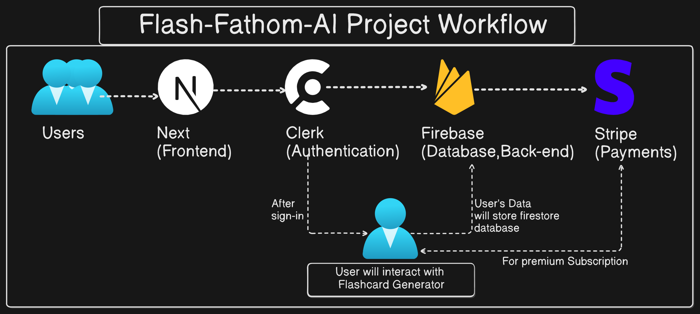

<div align="center">
  
</br>
     </img>
    </img>
    </img
                                                                                                       
[](https://github.com/Suraj-kumar00/Flash-Fathom-AI/actions/workflows/publish-to-dockerhub.yml)
                                                                                                      
[](https://github.com/Suraj-kumar00/Flash-Fathom-AI/actions/workflows/pulish-to-gcr.yml)

<br>
</div>
<br>
  

Introducing **FlashFathom AI** – the ultimate flashcard generator. Effortlessly create and study personalized flashcards with AI precision, while enjoying seamless user experiences and secure payments. 
[**Get started today**](https://flash-fathom-ai.vercel.app/), track your learning progress, and join a growing community of satisfied users. Would you be ready to elevate your study game? Sign up now and unlock your learning potential!

## Demo
<div align="center">
  </img>
</div>


## Build with
- Next.js
- Clerk
- Firebase
- OpenAI
- Stripe.

## DevOps Practices
- Containerization(Docker)
- Automation(CI/CD) using GitHub Actions


## Project WorkFlow



## Features
- **Clerk Authentication**: Secure, seamless user access.
- **SaaS UI & Landing Page**: Polished, user-friendly design.
- **AI Flashcards**: Instantly generate flashcards with OpenAI.
- **Firebase CRUD**: Easy data management.
- **Stripe Subscriptions**: Simple yearly and monthly payments.

## Installation 
For Installation on local machine follow bellow steps:
First [fork the reqpository](https://github.com/Suraj-kumar00/Flash-Fathom-AI/fork)

```sh
git clone https://github.com/your-username/Flash-Fathom-AI/
cd Flash-Fathom-AI
```
## Install the dependencies
**The package manager**
```sh
npm install -g pnpm
```
**Install pnpm pakcage manager**
```sh
pnpm install
```

If required for you: 
**Installing clerk**
```bash
pnpm add @clerk/clerk-sdk @clerk/nextjs
```

**OpenAI**
```bash
pnpm add openai
```

**Firebase**
```bash
pnpm add firebase
```
**Stripe**
```bash
pnpm add @stripe/stripe-js
```
**Shadcn UI**
```bash
pnpm add @shadcn/ui
```

## Running the project using Docker
First Install [**Docker Desktop**](https://www.docker.com/products/docker-desktop/)

**Pull the image**
```bash
docker pull surajkumar00/flashfathom-ai 
```
**Run the Container**
```bash
docker run -it -p 3000:3000 surajkumar00/flashfathom-ai
```
**Check localhost**
[localhost:3000](localhost:3000)


## Issue Reporting 🐛✨
If you encounter any bugs or have feature requests, please follow this format when opening an issue:

- Issue Title: 📝 A concise and descriptive title.
- Description: 🔍 Clear and detailed description of the issue or feature request.
- Steps to Reproduce (if applicable): 🚶Detailed steps to reproduce the issue.
- Expected Behavior: ✅What you expected to happen.
- Actual Behavior: ❌What actually happened.

## Development 👨‍💻
Want to contribute? Great!
We welcome contributions from the community! Please check our Contributing Guidelines for more details on how you can help improve us.
[**Read the Contribution Guidlines**](https://github.com/Suraj-kumar00/Flash-Fathom-AI/blob/main/CONTRIBUTING.md)


## 👀 Our Valuable Contributors 💖✨

Thanks to these wonderful people:
<br/>
<br/>
<a href="https://github.com/Suraj-kumar00/Flash-Fathom-AI/graphs/contributors">
  
</a>

 
## 📬 Contact
For questions or feedback, feel free to reach out via GitHub issues or contact the project maintainers. ✉️

## License

This project is licensed under the [MIT License!](https://github.com/Suraj-kumar00/Flash-Fathom-AI/blob/main/LICENSE)

## Support via giving a ⭐ star 

If you like this project, please give it a ⭐ star. Your support means a lot to us!

<h2 align="center"> Happy Coding🚀✨</h2>

