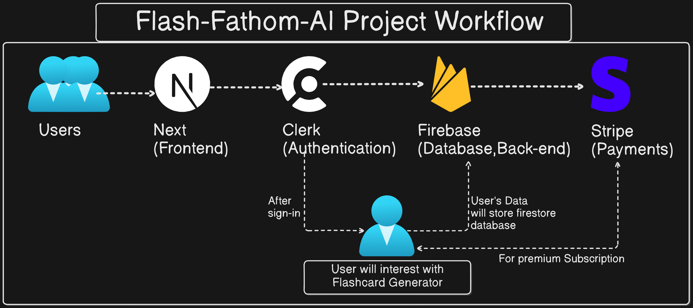

Introducing **FlashFathom AI** – the ultimate flashcard generator. Effortlessly create and study personalized flashcards with AI precision, while enjoying seamless user experiences and secure payments. 
[**Get started today**](), track your learning progress, and join a growing community of satisfied users. Ready to elevate your study game? Sign up now and unlock your learning potential!

## Build with
- Next.js
- Clerk
- Firebase
- OpenAI
- Stripe.

## DevOps Practices
- Containerization(Docker)
- Automation(CI/CD) using GitHub Actions


## Project WorkFlow



## Features
- **Clerk Authentication**: Secure, seamless user access.
- **SaaS UI & Landing Page**: Polished, user-friendly design.
- **AI Flashcards**: Instantly generate flashcards with OpenAI.
- **Firebase CRUD**: Easy data management.
- **Stripe Subscriptions**: Simple yearly and monthly payments.

## Installation 
For Installation on local machine follow bellow steps:
First [fork the reqpository](https://github.com/Suraj-kumar00/Flash-Fathom-AI/fork)

```sh
git clone https://github.com/your-username/Flash-Fathom-AI/
cd Flash-Fathom-AI
```
## Install the dependencies
**The package manager**
```sh
npm install -g pnpm
```
If required for you: 
**Installing clerk**
```bash
pnpm add @clerk/clerk-sdk @clerk/nextjs
```

**OpenAI**
```bash
pnpm add openai
```

**Firebase**
```bash
pnpm add firebase
```
**Stripe**
```bash
pnpm add @stripe/stripe-js
```
**Shadcn UI**
```bash
pnpm add @shadcn/ui
```

## Running the project using Docker
First Install [**Docker Desktop**](https://www.docker.com/products/docker-desktop/)

**Pull the image**
```bash
docker pull surajkumar00/flashfathom-ai 
```
**Run the Container**
```bash
docker run -it -p 3000:3000 surajkumar00/flashfathom-ai
```
On your browser check:
```sh
localhost:3000
```

## Development
Want to contribute? Great!

[**Read the Contribution Guidlines**](https://github.com/Suraj-kumar00/Flash-Fathom-AI/blob/main/CONTRIBUTING.md)

## License

[MIT](https://github.com/Suraj-kumar00/Flash-Fathom-AI/blob/main/LICENSE)
## Support via giving a ⭐ star 
